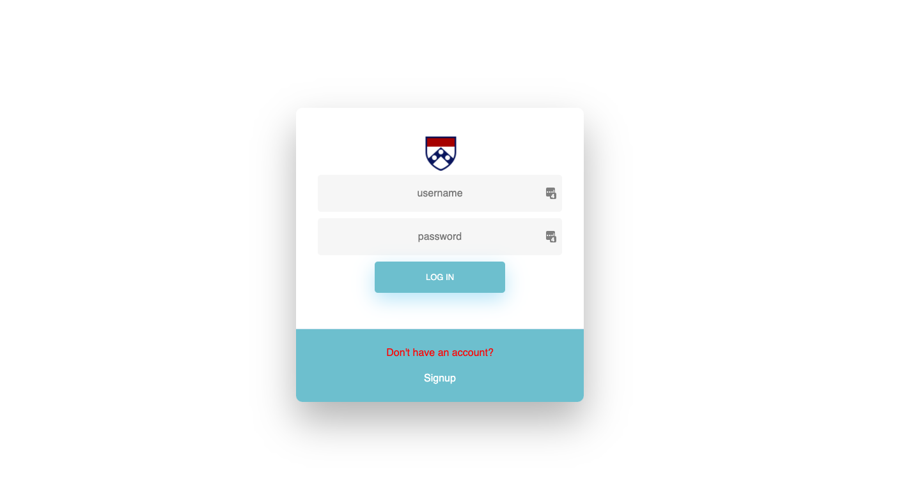
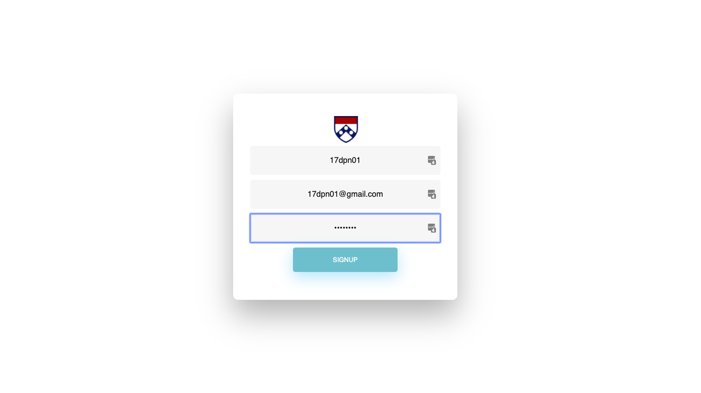
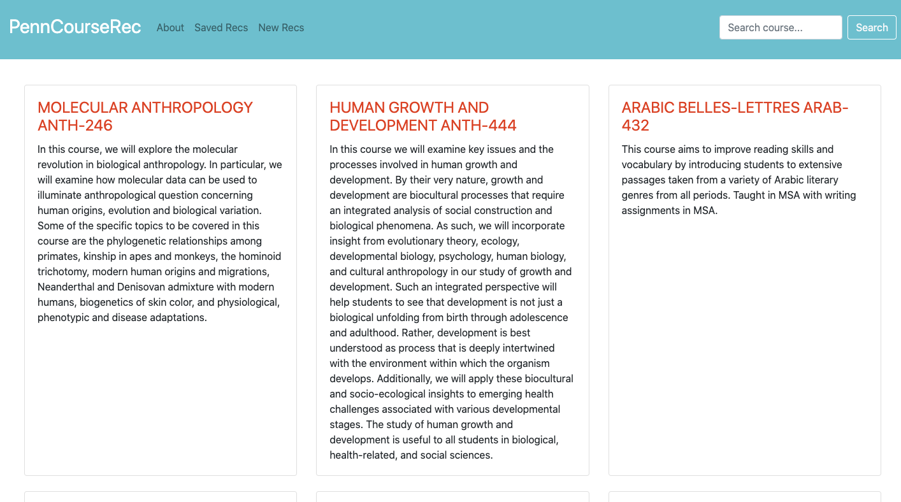
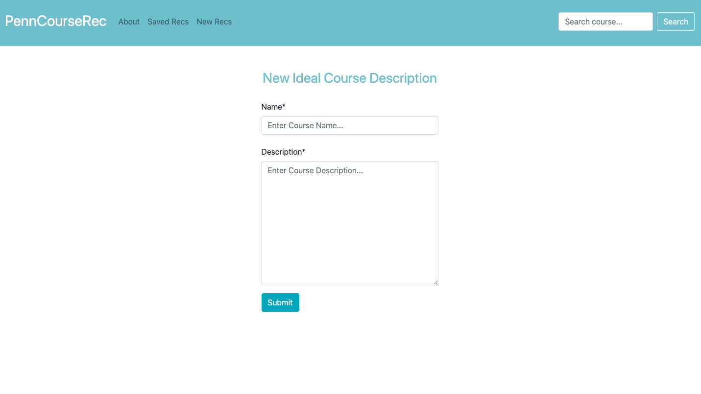
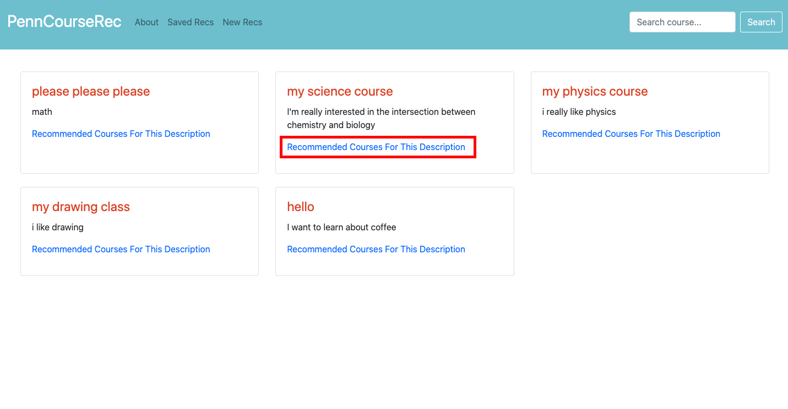
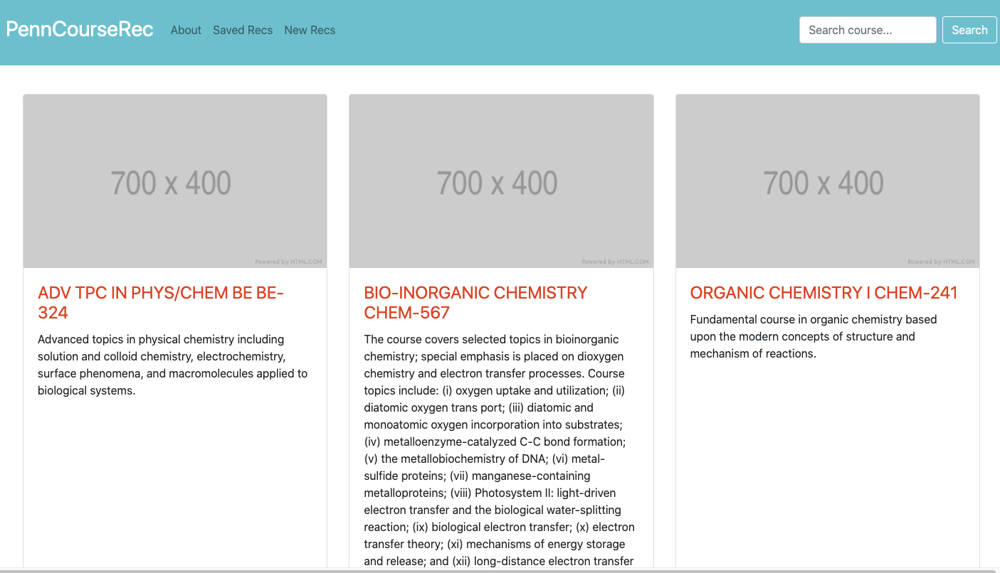

# PennCourseRec

A course recommender for UPenn students using natural language processing. 

## Workflow
User signup or log in:

View all available courses pulled from the PennLabs API. 

Enter in your desired course's title and description. Description can be as freeform as you would like. 

Then save your description or go directly to recommendations. Examples of saved descriptions are shown below. 

View your recommendation (here are the ones for the course titled "My Science Course" with the red box above).

